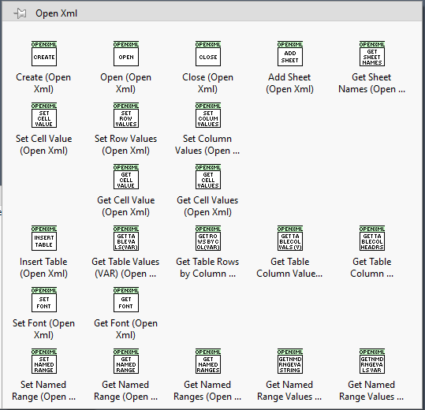
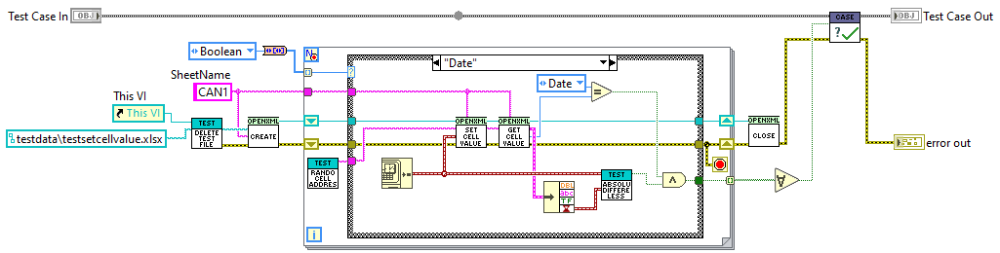
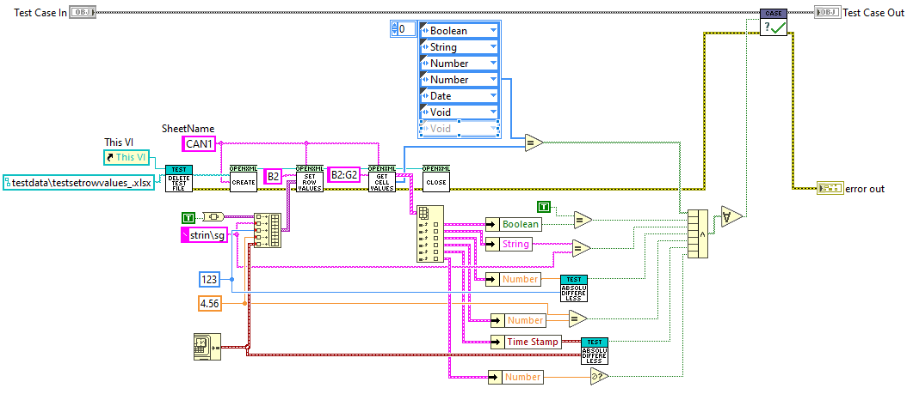
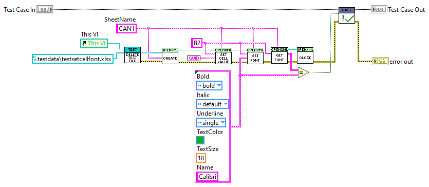
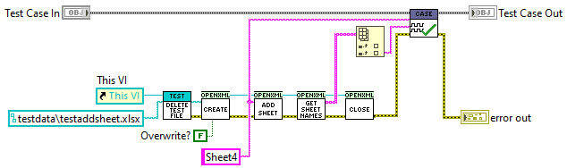
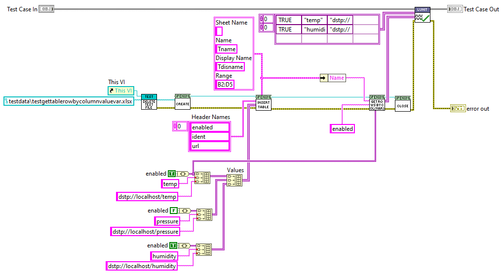
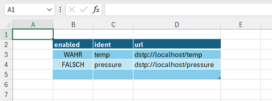

# OpenXML LabVIEW

A lightweight wrapper for creating and reading `.xlsx` Excel files using Open XML.  
This wrapper has been tested against [OpenXML SDK](https://github.com/dotnet/Open-XML-SDK) version **3.3.0** and **.NET Framework 4.6**.

---

## VIPM

The `vipm` folder contains a VIPM package with everything needed to use this wrapper.  
It creates an **Open Xml** palette under *Addons*.

---

## Prerequisites

- **LabVIEW 2019**
- **(Optional) Open XML SDK** – Download the following DLLs via NuGet when cloning this repository:
  - `DocumentFormat.OpenXml.dll`
  - `DocumentFormat.OpenXml.Framework.dll`

  > **Note:** Place these DLLs in the repository’s `Source` folder.

- **(Optional) LUnit Test Framework (LabVIEW 2020)** – [GitHub Repository](https://github.com/Astemes/astemes-lunit)

---

## Installation

1. Clone the repository:
   ```sh
   git clone https://github.com/pettaa123/Open-Xml-LabVIEW

## Public API

This library provides functions for setting and retrieving cell values and named ranges in an Excel worksheet.  
For example usage, refer to the `Test Open Xml` folder.



---

## Features

### Set/Get Cell Value
Sets and returns the value of a given worksheet cell, handling numeric, boolean, string, datetime types, and arrays.



### Set/Get Cell Range Values
Sets and returns the values of a given worksheet cell range.


### Set/Get Row Values
Sets and returns the values of a given worksheet row, handling numeric, boolean, string, and datetime types.



### Set/Get Cell Font
Sets and returns the font applied to a cell.



### Add/List Workbook Sheets
Adds new sheets and lists existing sheets.



### Get Table Rows by Column Value
Returns table rows filtered by a specified column value.

  


### Get Named Range Values (String)
Retrieves a specified named range from a worksheet as strings.


### Get Named Range Values (Variant)
Retrieves a specified named range from a worksheet as variants.

